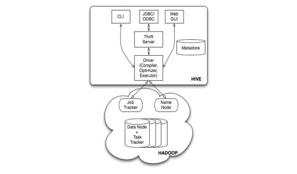

class: center, middle

# Hive触ってみた

---

# Hiveってなに

- Hadoop(HDFS+MapReduce)をベースにしたデータウェアハウス基盤
- HiveQLと言われるSQLライクな問い合わせ言語でデータの問い合わせ、分析を行う
  - HiveQLはMapReduceジョブに変換されHadoop上で実行される
  - HiveQLはSQLに基いているがSQL-92をフルサポートはしていない
- Facebookが開発してOSS化し、現在はApache Software Foundationが管理
- AWSのEMR(Elastic MapReduce)にも含まれる

- [Apache Hive](https://cwiki.apache.org/confluence/display/Hive/Home)
- [Wikipedia Apache_Hive](https://ja.wikipedia.org/wiki/Apache_Hive)

---

# Hiveのアーキテクチャ

---

# Hiveのできる

- 様々なインタフェースから実行できる
  - Command Line
  - JDBC
  - ODBC
  - PHP
  - Python
  - Thrift
- テーブルでのデータ型がある
- SQLの演算子をサポートしている
- 組み込み関数もある

---

# Hiveのちがう

- オンラインプロセスで使っちゃう

- [Apache Hive Tutorial](https://cwiki.apache.org/confluence/display/Hive/Tutorial)

---

# なんか似たようなのと比較

|名前   |概要                             |速度|扱えるデータ容量|
|:-----|:--------------------------------|:---:|:---:|
|Hive  |SQLを話してMapReduceを実施する蜂    |△|◯|
|Pig   |Pig語を話してMapReduceを実施するブタ |×|◯|
|Impala|SQLを話してメモリ上でMRを実施する速い鹿|◯|△|
|Presto|Impalaと大体同じで生き物ですら無い    |◯|△|
|Spark|Scalaしゃべってたのに最近はSQLも話す   |◯|△|

---

# Hiveのモチベーション

          ＿＿＿_
      ／           ＼
    ／  _ノ     ヽ､_  ＼
  ／ oﾟ(（●）) (（●）)ﾟo ＼  色々な視点からデータみたいお...
  |      （__人__）     |
  ＼       ｀ ⌒´      ／

---

# Hiveのモチベーション

             ＿＿＿_
          ／        ＼
        ／  _ノ  ヽ､_  ＼
      ／  oﾟ⌒     ⌒ﾟo    ＼  でもクエリ毎にMapReduce書かなきゃいけないお...
      |    （__人__）    |  
      ＼     ｀ ⌒´     ／

---

# Hiveのモチベーション

             ＿＿＿_
          ／ ⌒     ⌒ ＼
        ／（ ●）  （●） ＼
      ／:::⌒（__人__）⌒::: ＼  だったらSQL↔MapReduceの変換器つくるお！
      |      |r┬-|       |
      ＼      `ー'´     ／

---

# まとめると

- アドホックな使い捨てレポートや中量のデータのリアルタイム処理
  - Impala
  - Presto
  - Spark
- 大量のデータをバッチ処理での分析、解析
  - Hive
  - Pig

---

# 動かしてみる

- [Hive GettingStarted](https://cwiki.apache.org/confluence/display/Hive/GettingStarted)
  - これをもとにhiveをスタンドアロンで動かしました
- [Hue](http://jp.gethue.com/start-developing-hue-on-a-mac-in-a-few-minutes-2/)
- [HueDocker](https://github.com/cloudera/hue/tree/master/tools/docker)
